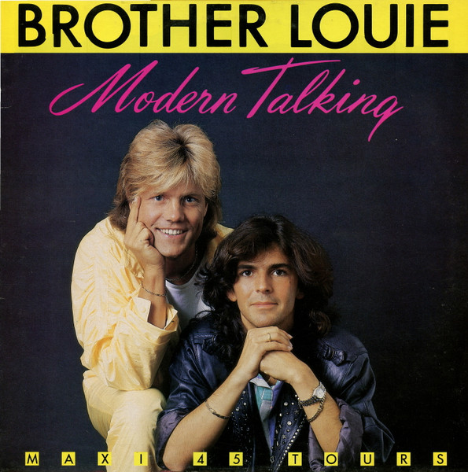

 

::video{id=https://www.youtube-nocookie.com/embed/K5DALXwOe0s}

也许很多人对这首歌的歌名不熟悉，但对这个曲调一定不陌生。80年代的欧式舞曲旋风，最具代表性的是Modern Talking组合。来自德国的Modern Talking组合组建于1983年，由于二位团员实力坚强，组建后即缔造锐不可挡的欧式舞曲风潮。

主唱者Thmas Anders有着一副特殊嗓音与迷人风采，极富创作才情的作曲者兼制作人Dieter Bohlen则是打造该组合黄金歌曲的重要人物。1984年推出的首支单曲『You’re My Heart, You’re My Soul』便以迅雷不及掩耳的强力旋风，吹刮在全球的各大小舞坛中。在发表了第二首单曲『You Can Win If You Want』以后一年，1985年首张LP大碟『The First Album』问世。

1986年的这首『Brother Louie』更是陪伴许多人走过青涩岁月的解压歌曲，这首歌非常出名，以至于被50多种语言翻唱过。林珊珊翻唱的粤语版叫『连锁反应』，邓洁仪翻唱的国语版叫『路灯下的小姑娘』。这几句"在一盏路灯的下面，有一个小姑娘在哭泣….亲爱的，小妹妹，不要不要哭泣…"，即使你不会唱，估计也会在当年大街小巷的各种扩音喇叭薰陶中能熟悉这个曲调！

以后的两年中，Modern Talking凭着优雅的假声演唱和清新的舞曲节拍红遍了整个世界，事业达到了顶峰。在Modern Talking的声势正如日中天时，两人竟因理念不合而在1987年时分道扬镳了，同年年底唱片公司推出两人解散后才出版的专辑『In The Garden Of Venus』。但如此的黄金组合怎可能就此解散消失呢！两人在度过不是很成功的十年单飞后，终于又在1998年重新携手合作，推出重组后的首张精选大碟『Back For Good』，并创下全球销售一千万张的佳绩。（根据网络资料整理）
