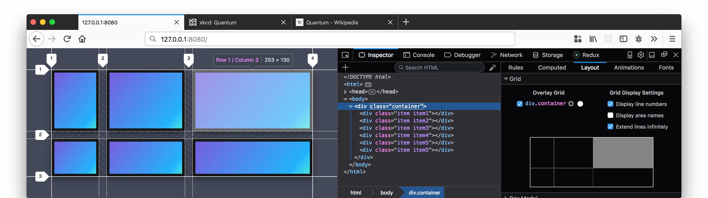

建立符合WEB标准的网站，应用XHTML与CSS来构建网站，我们往往处在开发与调试两个重要的环节，对于DIV+CSS的XHTML开发环境，页面的调试更加的重要。我们完全手写代码，需要不断的预览所形成的页面效果。而DIV+CSS这一形式是刚刚兴起的一种新技术，目前还不是非常的普及，我们需要不断的学习，浏览他人的成功作品从中汲取制作经验显得非常重要，也是我们学习的一种捷径。

现在我们介绍一种网页调试的辅助工具：[Web Developer！](https://www.mozilla.org/en-US/firefox/developer/) 它是运行在FF（指Firefox浏览器下同）环境中的插件，是目前公认为最为优秀的网页调试工具。

Web Developer作为FF的插件存在，主要功能表现在几个重要的方面：

对页面中的文本、图像、媒体文件进行控制，对网页所应用的CSS文件的id与class辅助查看，表格辅助查看，可以实现修改CSS文件实时显示出得到的页面效果等等。

Web Developer插件能够帮助我们对CSS网站进行分析，我们使用FF对网页进行浏览，运用Web Developer插件不仅仅只是能看到对方的源代码，还能方便的分析出页面的布局结构，CSS书写方式，鼠标所在位置的id或class是什么等等，使我们能迅速的理解、学习别人的成功经验，进而更加方便快捷的掌握CSS布局技术。

版本	1.1.6 简体中文版

版权所有	软件发行商

软件平台	Firefox 1.0-3.0*

整理日期	2008年05月25日

软件授权	免费使用
[Web Developer！](https://www.mozilla.org/en-US/firefox/developer/)
