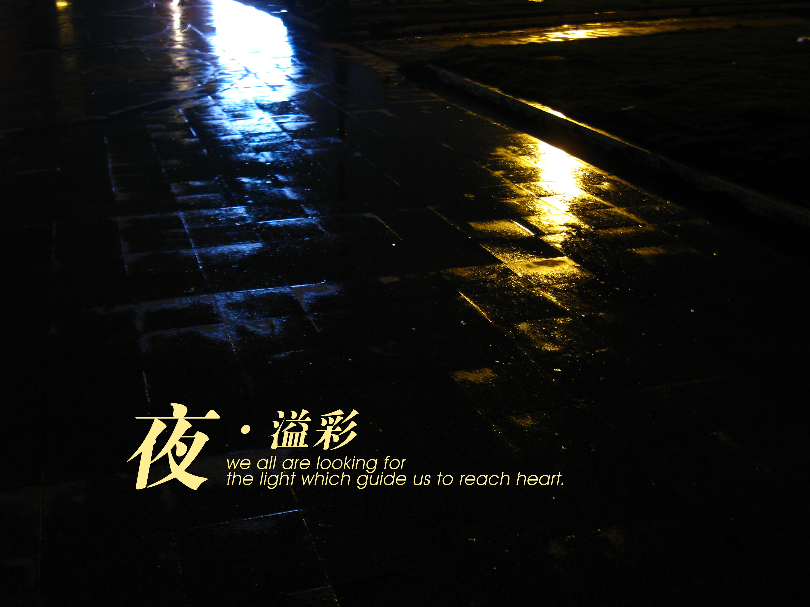
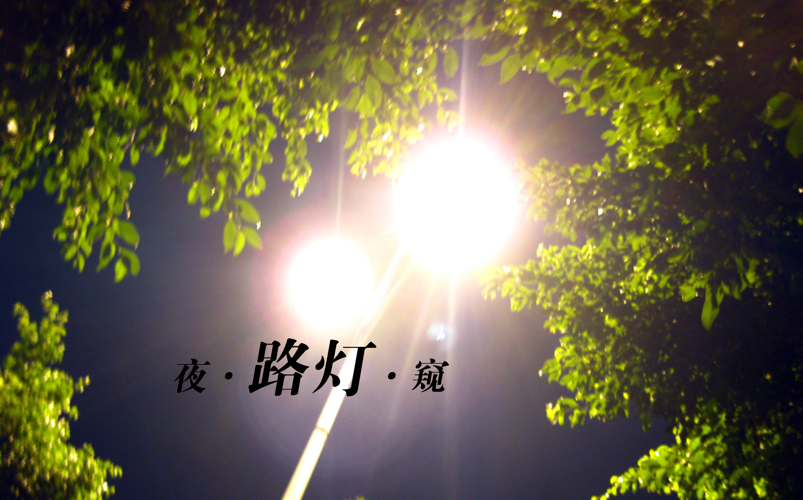
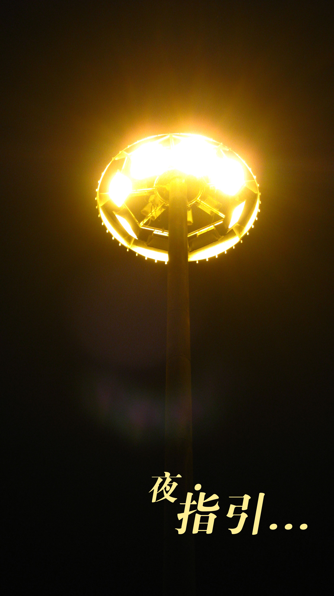
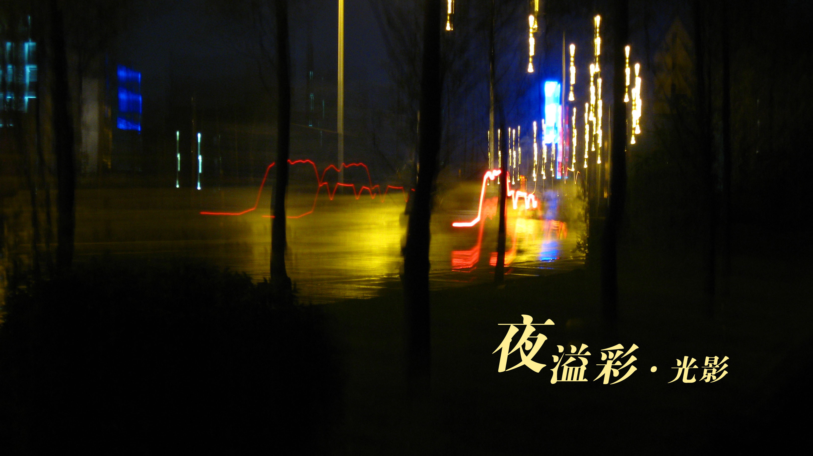
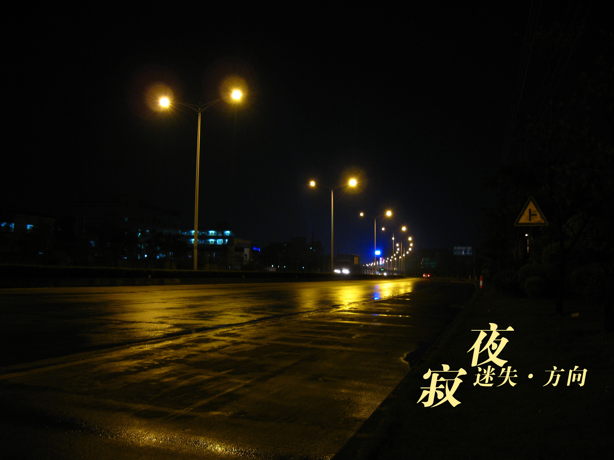
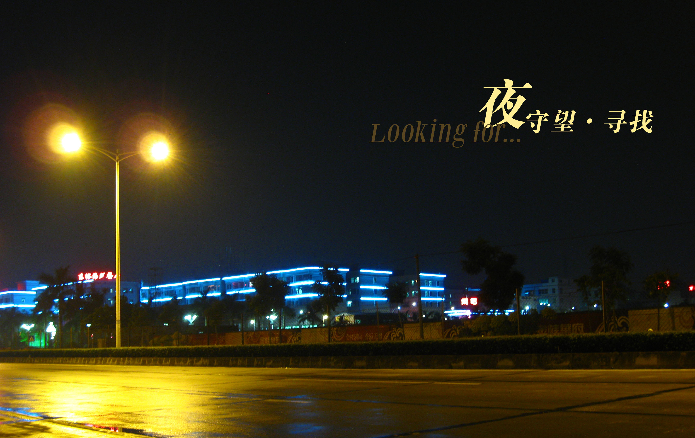

广场上，雨后，雨水依然残留在路面上，远处的灯光倒影反射出光彩一点也不亚于霓虹灯

 

广场上的灯塔就想一个方向的坐标，夜色中追逐的目标，追求人生的绚烂

路边一个静静的地方，欣赏着路灯的跳动，汽车来往间的穿梭。听着远处飘来的歌声，灯光就好像一个个跳动的音符。寂静的公路上的，让人特别想知道另一边是什么样的城市，一个家的方向，总能想起远方的家

看着路边五光十色的城市，让人迷失方向…

秋季来临，草已不再争绿，进入这个季节总让人期盼。今晚虽不能看见圆圆的月亮，提前祝福大家中秋团圆。
