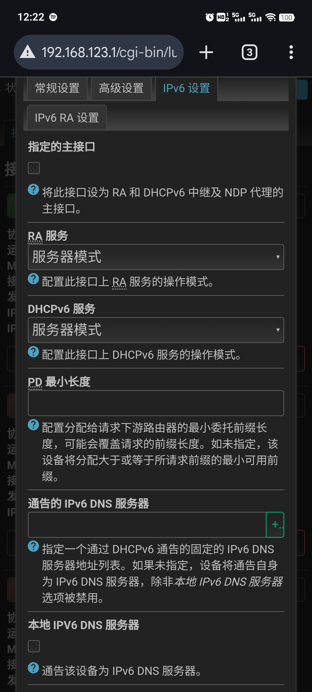

最近调试富强网络，一直有断流和干扰，排查一开始以为是客户端fallback dns2问题，经过排查发现是我在设置openwrt的时候不小心勾选了ipv6本地dns，巧合的是设置电视盒子富强的时候，死活富不上，最后adb shell盒子 指令 getprop 输出排查发现

 

```
[net.dns1]: [fd00:0000:xxxx]
[net.dns2]: [192.168.123.2]
[net.dns3]: [192.168.123.1]
```

dns1居然是本地ipv6链路地址，变成首选dns，查看路由器openwrt设置错误导致，取消勾选 本地 IPV6 DNS 服务器，解决。

 

