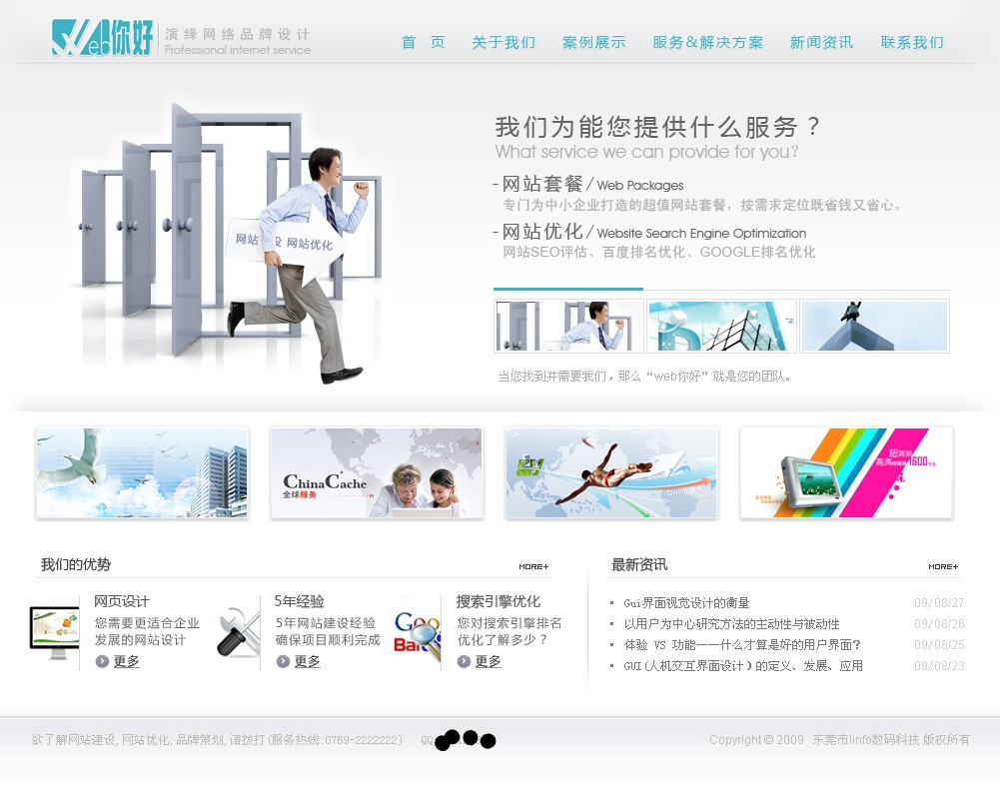

注册了个域名，兴奋之中，为此又设计了两个版面，大家有砖的抛砖吧。
此番发图就是为了求砸砖的，走过，路过，千万要仔细看啊，仔细挑啊，
您觉得哪里不好，或者哪里需改正的，尽管放马过来吧，批评越狠越好！

综合上次大家对“web你好”logo的见解，我选中了天蓝色的那个（呵呵，天蓝色其实也是本人比较喜欢的颜色），蓝色代表着科技与活力吧。

第一个版面的设计理念：
1.追求简洁——简洁一直是我追求的理念，没有太多装饰，但是要看起来很舒服，颜色要比较养眼，让浏览者一眼就浏览到他们最感兴趣的东西。
整个版面没有太纷杂的颜色，只有蓝色和灰色，版面中间四个小图片是用来放最新案例展示的（颜色可多变），作为整个版面的点缀颜色；

2.我们的优势
介绍一下我们的特色，吸引浏览者，让浏览者有信心进入内页浏览；

3.最新资讯
小模块展示，把最新的新闻啊等文字性内容放在首页。

第二个版面的设计理念：
设计理念跟上面基本一致的啦，所以就不再啰嗦了哦。
此版面我不是很满意，黑色以及蓝色的结合，本来最初是想做出有深度有水平的那种意境，结果后来发现越往下做就越没有什么信心了，不过偶发现这个颜色做博客会比较适合一些……

【注：文字内容有些直是暂时性替代，某些图片是从其他网站上截图而来的】